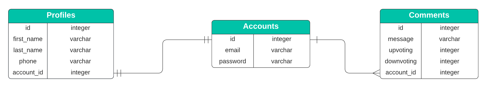

# Exercício Sequelize: Relacionamentos 1:1 e 1:N

Nesse exercício você irá exercitar a criação de relacionamentos **1:1** e **1:N** utilizando o _Object-Relational Mapping_ (ORM) Sequelize.

Ao final do exercício é esperado que os seguintes objetivos de aprendizagem sejam atingidos:

- Identificar as situações que requerem um relacionamento 1:1 ou um relacionamento 1:N; 👀
- Aplicar os conceitos de relacionamento 1:1 e relacionamento 1:N utilizando o Sequelize; :smirk:
- Reconhecer a importância do emprego correto do relacionamento 1:1 e 1:N em base de dados no processo de desenvolvimento de software. :heart_eyes:


## 🛠 Módulos utilizados
Esse projeto foi construído utilizando Node 16.15.1 em conjunto com os seguintes módulos:
- express 4.18.1
- sequelize 6.21.1
- sequelize-cli 6.4.1
- dotenv 16.0.1
- mysql2 2.3.3
- nodemon 2.0.19


## ‼️ Antes de iniciar
Crie um **fork** desse projeto. Caso tenha alguma dúvida siga esse [tutorial de como realizar um fork](https://docs.github.com/pt/get-started/quickstart/contributing-to-projects) :balloon:

Após realizar o _fork_ deste projeto, faça um **clone** do mesmo para o seu computador. Ao terminar o processo de clonagem do repositório entre, via terminal, até a pasta raiz do repositório e execute o comando `npm install` para instalar os módulos necessários ao correto funcionamento do projeto.

Depois crie uma nova branch `sequelize-associations-11-1n` com o comando `git checkout -b sequelize-associations-11-1n`. É nessa _branch_ que você realizará a solução para o exercício.

Leia com atenção as instruções e observe com cuidado o que é esperado neste exercício. :sunglasses:


## 🌍 Trybe Blog Comments
O início dos anos 2000 foi marcado com a popularização dos **blogs**, uma aplicação _Web_ cuja a estrutura permite a atualização rápida a partir de acréscimos dos chamados artigos, postagens ou publicações.

Uma das capacidades relevantes de um **blog** é a capacidade de leitores deixarem comentários nas postagens, permitindo interagir com outras pessoas, incluindo a pessoa autora da postagem.

No presente exercício você irá implementar um mecanismo simples de armazenamento de comentários (um recorte bem simplista de uma aplicação _Web_ de blog) mas que permitirá exercitar os conceitos de relacionamento 1:1 e 1:N aprendidos no **course**. :tada:

Iremos trabalhar com o Sistema Gerenciador de Banco de Dados (SGBD) MySQL 8.0, criando uma base de dados de acordo com o diagrama entidade-relacionamento (DER) mostrado abaixo:



No diagrama podemos ver a existência de três tabelas:

- **Accounts (Contas)**: Tabela responsável por armazenar os dados da conta de acesso da aplicação Web.
-  **Profiles (Perfis)**: Tabela responsável por armazenar os dados de perfil de uma conta de acesso da aplicação Web.
- **Comments (Comentários)**: Tabela responsável por armazenar os dados referentes a comentários realizados pelas contas de acesso da aplicação Web.

Um ponto importante a se notar no diagrama é como as entidades estão ligadas (relacionadas): 
- Entre as tabelas **Accounts** e **Profiles** existe uma relação `um para um`, ou seja, uma conta de acesso possui apenas um único perfil.
- Do mesmo modo as tabelas **Accounts** e **Comments** possui um relacionamento `um para muitos`, ou seja, uma conta de acesso pode possuir vários comentários associados a ela.


### ⚠️ Criação do banco de dados e iniciando a aplicação
<details><summary><strong>Instruções para rodar a aplicação localmente</strong></summary>

1. Primeiramente será necessário criar um arquivo `.env` que tenha as variáveis de ambiente necessárias para que a aplicação acesse seu SGBD MySQL (existe um arquivo chamado de `.env.example` o qual pode ser copiado e renomeado para `.env`).

O arquivo '.env' deve conter o seguinte conteúdo:

```bash
DATABASE_USER=root
DATABASE_PASSWORD=password
DATABASE_HOSTNAME=hostname
PORT=3001
```

Onde:
- _DATABASE_USER_: Nome de usuário do MySQL. Aqui estamos utilizando o usuário **root** mas, em um ambiente de produção, deve-se utilizar um outro usuário por questões de segurança;
- _DATABASE_PASSWORD_: A senha do nome de usuário especificado em _DATABASE_USER_;
- _DATABASE_HOSTNAME_: O nome do _host_ (computador hospedeiro) no qual o servidor MySQL está sendo executado. Caso você esteja executando o servidor MySQL no seu computador local o valor deve ser `127.0.0.1`;
- _PORT_: A porta usada pelo servidor Node da API.

2. Instale as dependências

```bash
npm install
```

3. Execute os seguintes comandos para criar a base de dados `trybe_blog_comment` no seu servidor MySQL e popular as tabelas com alguns dados

```bash
npx sequelize-cli db:drop
npx sequelize-cli db:create
npx sequelize-cli db:migrate
npx sequelize-cli db:seed:all
```

4. Inicie o servidor da API

```bash
npm run debug
```
</details>

<details><summary><strong>Instruções para rodar a aplicação via Docker</strong></summary>
  
Existe um arquivo `docker-compose.yml` configurado caso queira rodar os contêineres via Docker.

1. Inicie os contêineres

```bash
docker-compose up -d
```

2. Acesse o contêiner da API

```bash
docker exec -it exercise-sequelize-associations-11-1n-api-1 bash
```

3. Instale as dependências

```bash
npm install
```

4. Execute os seguintes comandos para criar a base de dados `trybe_blog_comment` no seu servidor MySQL e popular as tabelas com alguns dados

```bash
npx sequelize-cli db:drop
npx sequelize-cli db:create
npx sequelize-cli db:migrate
npx sequelize-cli db:seed:all
```

5. Inicie o servidor da API

```bash
npm run debug
```
</details>

## Exercícios

🚀 Se liga nesse foguete!
Os exercícios destacados com 🚀 são os fundamentais pra você ir bem no projeto! Todos os exercícios vão contribuir com sua formação mas fique de olho nesses! 👀

### Exercício 01 🚀
Implementar o código referente ao _model_ `Account` em um arquivo JavaScript dentro da pasta _models_ que contenha os seguintes atributos:

- **id**: Chave primária de indexação dos registros de conta. Valor do tipo _inteiro_;
- **email**: Campo responsável por armazenar um endereço de email que será utilizado como informação para entrar no sistema. Valor do tipo _string_ (_varchar_ no SGBD);
- **password**: Campo responsável por armazenar a senha da conta relacionada. Valor do tipo _string_ (_varchar_ no SGBD).

### Exercício 02 🚀
Implementar o código referente ao _model_ `Profile` em um arquivo JavaScript dentro da pasta _models_ que contenha os seguintes atributos:

- **id**: Chave primária de indexação dos perfis de conta. Valor do tipo _inteiro_;
- **firstName**: Campo responsável por armazenar o primeiro nome da pessoa que possui uma conta na aplicação. Valor do tipo _string_ (_varchar_ no SGBD);
- **lastName**: Campo responsável por armazenar o último nome da pessoa que possui uma conta na aplicação. Valor do tipo _string_ (_varchar_ no SGBD);
- **phone**: Campo responsável por armazenar o telefone da pessoa que possui uma conta na aplicação. Valor do tipo _string_ (_varchar_ no SGBD);
- **accountId**: Chave estrangeira de indexação de um registro de perfil com sua respectiva conta. Valor do tipo _inteiro_.

### Exercício 03 🚀
Implementar o código referente ao _model_ `Comment` em um arquivo JavaScript dentro da pasta _models_ que contenha os seguintes atributos:

- **id**: Chave primária de indexação dos comentários. Valor do tipo _inteiro_;
- **message**: Campo responsável por armazenar o texto de um comentário de uma determinada conta. Valor do tipo _string_ (_varchar_ no SGBD);
- **upvoting**: Campo responsável por armazenar a quantidade de votos positivos que um determinado comentário recebeu. Valor do tipo _integer_;
- **downvoting**: Campo responsável por armazenar a quantidade de votos negativos que um determinado comentário recebeu. Valor do tipo _integer_;
- **accountId**: Chave estrangeira de indexação de um registro de perfil com sua respectiva conta. Valor do tipo inteiro.


### Exercício 04
Realizar as modificações necessárias nos arquivos de definição dos _models_ de forma a adicionar um relacionamento 1:1 entre os models `Account` e `Profile`.

### Exercício 05 🚀
Realizar as modificações necessárias nos arquivos de definição dos _models_ de forma a adicionar um relacionamento 1:N entre os models `Account` e `Comment`.

### Exercício 06
Implemente um _endpoint_ que seja capaz de listar uma conta com seu respectivo perfil. O endpoint deve ser `/accounts/:id` e deve utilizar o método **GET**, onde **:id** é o identificador de uma conta com seu respectivo perfil. 

✨ **DICA:** Use o _eager loading_ para recuperar do banco as informações de `Account` e `Profile` em uma única consulta do banco de dados

Abaixo um exemplo de retorno esperado endpoint `/accounts/1` para o parâmetro **:id** com valor igual a 1.

```json
{
  "id": 1,
  "email": "elaine.stevens@tryber.com",
  "password": "s3cr3t",
  "profile": {
   "id": 1,
   "firstName": "Elaine",
   "lastName": "Stevens",
   "phone": "(116) 941 9747",
   "accountId": 1
  }
}
```

### Exercício 07
Implemente um _endpoint_ que, diferente do exercício anterior, seja capaz de listar uma conta utilizando _lazy loading_. O endpoint deve ser `/accounts-v2/:id` e deve utilizar o método **GET**, onde **:id** é o identificador de uma conta. 

Abaixo um exemplo de retorno esperado endpoint `/accounts-v2/1` para o parâmetro **:id** com valor igual a 1.

```json
{
	"id": 1,
	"email": "elaine.stevens@tryber.com",
	"password": "s3cr3t"
}
```


### Exercício 08 🚀
Implemente um _endpoint_ que seja capaz de listar os comentários de uma determinada conta. O endpoint deve ser `/accounts/:id/comments` e deve utilizar o método **GET**, onde **:id** é o identificador de uma conta. 

Abaixo um exemplo de retorno esperado endpoint `/accounts/1/comments` para o parâmetro **:id** com valor igual a 1.

```json
[
	{
		"id": 1,
		"message": "Lorem ipsum dolor sit amet, consectetur adipiscing elit. Cras nec erat fringilla, accumsan felis eu, ullamcorper velit. Mauris at nunc a sem imperdiet pretium.",
		"upvoting": 2,
		"downvoting": 23,
		"accountId": 1
	},
	{
		"id": 2,
		"message": "Nada que vale a pena é fácil. Lembre-se disso",
		"upvoting": 28,
		"downvoting": 15,
		"accountId": 1
	}
]
```

## Exercício Bônus 01 🚀
Implemente um _endpoint_ que seja capaz de cadastrar uma conta e um perfil. O endpoint deve ser `/accounts` e deve utilizar o método **POST**. A requisição deve conter o seguinte _JSON_ no corpo (_body_):

```json
{
  "email": "luke.skywalker@tryber.com",
  "password": "c3p0123",
  "firstName": "Luke",
  "lastName": "Skywalker",
  "phone": "(832) 9999 1234",
}
```

☝ No servidor _backend_ (aplicação Node.js com express) deve-se criar primeiramente um registro de `Account` e salvar o mesmo no banco de dados e, em seguida, criar um registro de `Profile` e salvar o mesmo no banco de dados adicionando o valor de **accountId** (que é obtido ao salvar o registro de `Account` no banco de dados). 

Fique livre em implementar a resposta desta requisição da forma que achar apropriada.

## Exercício Bônus 02 🚀
Implemente um _endpoint_ que seja capaz de cadastrar um comentário que esteja relacionado a uma conta. O endpoint deve ser `/accounts/:id/comment` e deve utilizar o método **POST** onde **:id** é o identificador de uma conta. A requisição deve conter o seguinte _JSON_ no corpo (_body_):

```json
{
	"message": "Lorem ipsum dolor sit amet, consectetur adipiscing elit. Cras nec erat fringilla, accumsan felis eu, ullamcorper velit. Mauris at nunc a sem imperdiet pretium.",
},
```

☝ No servidor _backend_ (aplicação Node.js com express) deve-se criar um registro de `Comments`, colocar o valor zero nos campos **upvoting** e **downvoting** e salvar o mesmo no banco de dados adicionando o valor de **accountId** (que é obtido através do parâmetro **:id** da requisição). 

Fique livre em implementar a resposta desta requisição da forma que achar apropriada.
